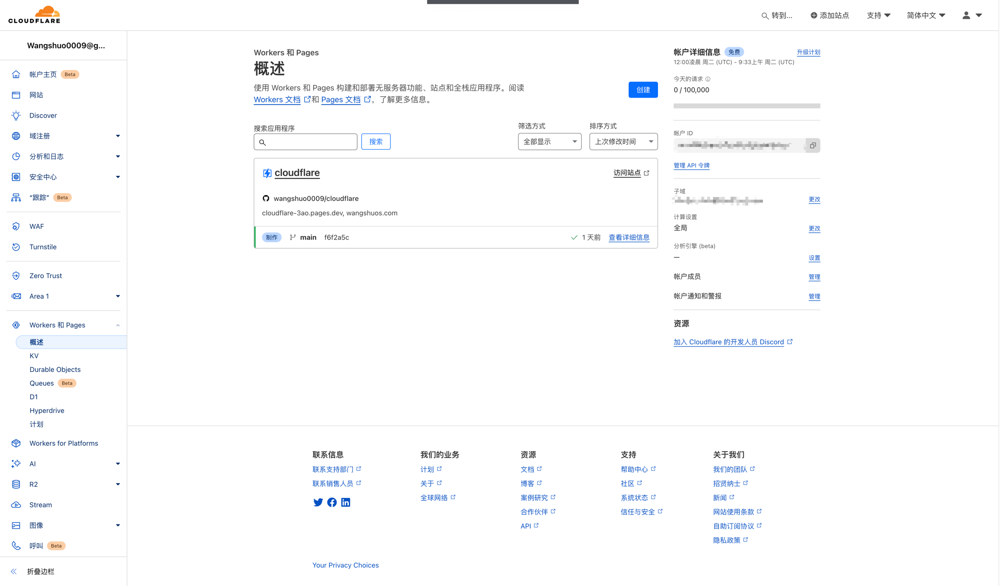
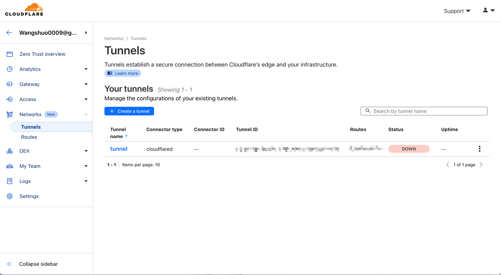
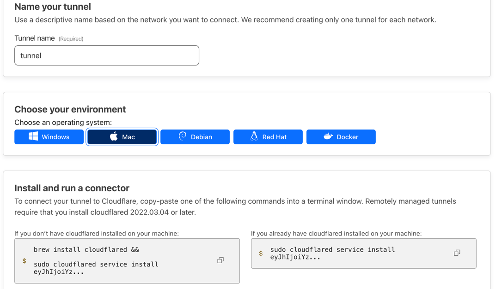

# [cloudflare](https://www.cloudflare-cn.com/)
## 主要用于本人学习使用cloudflare
### 用于部署在cloudflare服务上：
* [cloudflare workers-and-pages](https://dash.cloudflare.com/) 下创建的Pages静态的项目
* [Worker官方文档](https://workers.cloudflare.com/docs) :支持有限语言JavaScript、TypeScript、Python、Rust， [Pages官方文档](https://developers.cloudflare.com/pages/) ：前端服务仅支持有限架构
* 后端服务通过穿透访问
  

# cloudflare Tunnel 穿透
## [Zero Trust](https://one.dash.cloudflare.com/) 模块下
### Networks 

* Tunnels 
* 本人选用[通过仪表板设置隧道](https://developers.cloudflare.com/cloudflare-one/connections/connect-networks/get-started/create-remote-tunnel/)
* 创建完成后可通过下面命令即可创建对应系统的启动服务

